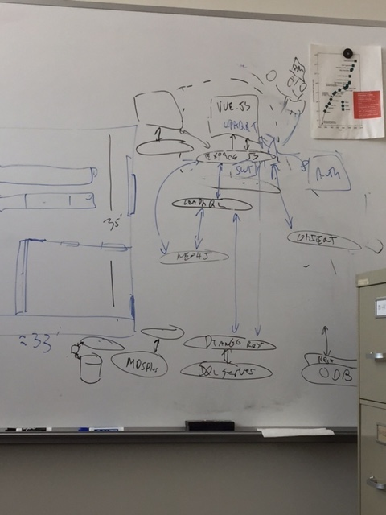

# Meeting Wednesday 8/9/17
## John, Martin, Josh

## John talked with Chris Hill yesterday
1. Chris sees applications similar to git + slack (not so clear to us this matches)
2. There is a project involving integrating disperate ocean data that may be a good fit
3. Chris is willing to try things
4. John will send him this github url
5. There is a rest api for netcdf and their contents (name ?)

## We taked about what the client / server communication stack (of servers) would look like
1. One interesting conclusion - data driven schemas can just mean schemas with discoverable capabilities.
2. If you have a server for SQL  it can answer 
* I know about table like things
 * I have these tables
 * These tables have these columns
 * ...
3. In this way, site extensibility means - extend the capabilities of the servers that serve the underlying data, and make the discovery enpoints describe these new capabilities
4. Some debate about if the user facing application(s) should talk directly to the data sources, or this should be mitigated by a web server
5. Some compelling arguments on both sides
 * It is one place to do authentication
 * It is one URL that the vue.js can talk to
 * That server would have to know about all of the primitive data servers and how to talk to them
  * (could this also be discoverable)
 * That server is potentially a performance choke point
 * That server is potentially a complexity choke point
6. 

 
## Not discussed with Jason yet, but hopefully he can demo sometthing at meeting Wednesday 8/23
 
