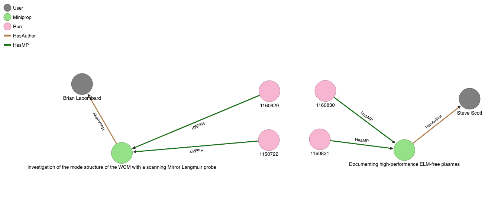

# OrientDB setup and use instructions

**TLDR;**

If you have orientdb installed and running use
the `local/ndm_orientdb_backup.zip` file to restore the database backup in
the orientdb console. 

```
console> restore database local/ndm_orientdb_backup
```

**TLDR;**


OrientDB may be installed as a binary, from source or as a docker
module. We have used the [docker distribution](
https://www.linuxbabe.com/linux-server/install-docker-on-debian-8-jessie-server).
(Docker requires a linux kernel, but there are [installers](https://docs.docker.com/engine/installation/) for Windows
and OSX that embed their own kernel)

Begin by creating a local areas for peristent storage. 
The `local` directory is provided in the git repo.

    mkdir config databases backup

To start the orientdb server, we run the docker image from the
orientdb repo, opening ports
2424 (binary db interface port) and 2480 (http port for orientdb http
api and web studio).

```
docker run -d --name orientdb \
-p 2424:2424 -p 2480:2480  \
-v $PWD/orientdb/config:/orientdb/config \
-v $PWD/orientdb/databases:/orientdb/databases \
-v $PWD/orientdb/backup:/orientdb/backup \
-v $PWD/orientdb/local:/orientdb/local \
-e ORIENTDB_ROOT_PASSWORD=ankmyx \
orientdb \
/orientdb/bin/server.sh
```

Mounting the local directories with `-v` is import for persistence.

At this point, you should be able to open Studio on the host system at
http://localhost:2480 . Log in with:
```
 username: root
 password: ankmyx
```
If the docker host is not your desktop/laptop, you can forward ports, eg:

    ssh -L2480:172.17.0.2:2480 -L2424:172.17.0.2:2424  ndm@192.168.0.102

Replace the username and  IP address with what ever username and  address your docker host is on.

Now lets populate. In Studio, select 'New DB', Name: ndm_db, User:
root, password:ankmyx (or what ever you used when creating the
server.)

Equivalently, start a console and create:

```
ip addr show docker0   #get ip address of host for containers
docker run --rm -it orientdb /orientdb/bin/console.sh
orientdb> connect remote:172.17.0.1 root ankmyx
```
`plocal` protocol can also be used from the same machine as the
server. However, it cannot be used while Studio is connected, and
would require using something like `docker exec -it orientdb /orientdb/bin/console.sh` 
to execute in the running container. However, in this case, `remote`
will still work.

Now use the Extractor Transformer and Loader (ETL) utility. Please
check the dbURL field to point the to orientdb server for your local
install. The command we are running uses docker to spin up a temporary
(`--rm`) orientdb container (different than the one the server is
running in) that mounts a the `local` directory so that the csv and
json files are available, and executes the ETL tools (`oetl.sh`) to
import the csv files using the descriptions in the json files.

```
cd orientdb/local
docker run  --rm -it -v $PWD:/orientdb/local orientdb:latest /orientdb/bin/oetl.sh /orientdb/local/orientdb_inject_users.json
docker run  --rm -it -v $PWD:/orientdb/local orientdb:latest /orientdb/bin/oetl.sh /orientdb/local/orientdb_inject_miniprop.json
docker run  --rm -it -v $PWD:/orientdb/local orientdb:latest /orientdb/bin/oetl.sh /orientdb/local/orientdb_inject_run.json
docker run  --rm -it -v $PWD:/orientdb/local orientdb:latest /orientdb/bin/oetl.sh /orientdb/local/orientdb_inject_runlist.json
docker run  --rm -it -v $PWD/orientdb/local:/orientdb/local orientdb:latest /orientdb/bin/oetl.sh /orientdb/local/orientdb_inject_shots.json
docker run  --rm -it -v $PWD/orientdb/local:/orientdb/local orientdb:latest /orientdb/bin/oetl.sh  /orientdb/local/orientdb_inject_entries.json

```

In the BROWSE tab of the Studio or in a console, run
`update User set name=name.trim()` to cleanup the User.name record.
In our injecting files, we also created classes and edges for the
incoming data and converted foreign keys in the SQL export to
relations represented by edges in OrientDB: HasAuthor and HasMP.

Now we can execute some queries. Let's define a query that finds all
authors who wrote miniproposals that were used in more than one run.

``` 
create function twousers
"SELECT R.run,U.name,M.mp from (
MATCH
{class:User ,as:U} <-HasAuthor- {class:Miniprop, as:M} <-HasMP-{class:Run, as:R}
return U,M,R
 )
WHERE 
M.in('hasMP').size()>1;" 
idempotent true LANGUAGE SQL
```

We can execute this in the console or Studio with `SELECT
twousers()`. Because OrientDB has an HTTP API, we can fetch this with
curl:
`curl  http://localhost:2480/function/ndm_db/twousers --user admin:admin -H 'Accept:application/json' | python -m json.tool`

Results:

```js
{
    "result": [
        {
            "@rid": "#-2:1",
            "@type": "d",
            "@version": 0,
            "M": 2269,
            "R": 1150722,
            "U": "labombard"
        },
        {
            "@rid": "#-2:2",
            "@type": "d",
            "@version": 0,
            "M": 2269,
            "R": 1160929,
            "U": "labombard"
        },
        {
            "@rid": "#-2:3",
            "@type": "d",
            "@version": 0,
            "M": 2351,
            "R": 1160830,
            "U": "sscott"
        },
        {
            "@rid": "#-2:4",
            "@type": "d",
            "@version": 0,
            "M": 2351,
            "R": 1160831,
            "U": "sscott"
        }
    ]
}
```

This can be visualized in the Studio by running the query directlly,
using the expand function on the returned records and adding useful
labels in the graph tab:

`Select from  (TRAVERSE out(`HasAuthor`) from  (select from Miniprop where in(`HasMP`).size() > 1)) `

(currently, MATCH selections do not return data formatted correctly for the graph editor)


.

Runs with entries:
`match {class:Run, as:R} <-HasRun- {class:Entry, as:E} return R.run`

Returns the list:
```
1150722
1160929
1160830
1160831
```

